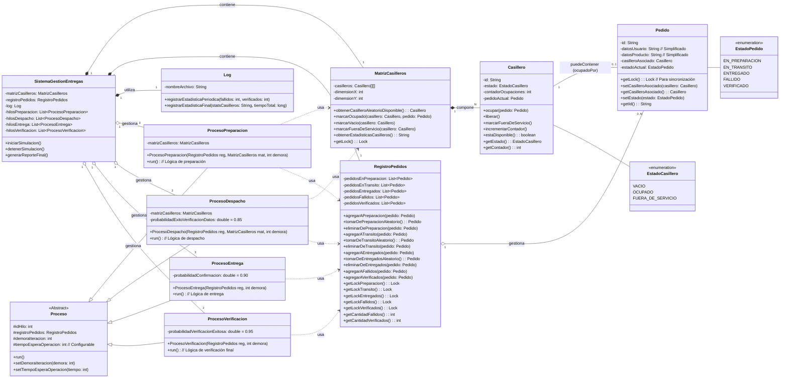

```mermaid
classDiagram
    direction LR

    class SistemaGestionEntregas {
        -matrizCasilleros: MatrizCasilleros
        -registroPedidos: RegistroPedidos
        -log: Log
        -hilosPreparacion: List~ProcesoPreparacion~
        -hilosDespacho: List~ProcesoDespacho~
        -hilosEntrega: List~ProcesoEntrega~
        -hilosVerificacion: List~ProcesoVerificacion~
        +iniciarSimulacion()
        +detenerSimulacion()
        +generarReporteFinal()
    }

    class MatrizCasilleros {
        -casilleros: Casillero[][]
        -dimensionX: int
        -dimensionY: int
        +obtenerCasilleroAleatorioDisponible(): Casillero
        +marcarOcupado(casillero: Casillero, pedido: Pedido)
        +marcarVacio(casillero: Casillero)
        +marcarFueraDeServicio(casillero: Casillero)
        +obtenerEstadisticasCasilleros(): String
        +getLock(): Lock
    }

    class Casillero {
        -id: String
        -estado: EstadoCasillero
        -contadorOcupaciones: int
        -pedidoActual: Pedido
        +ocupar(pedido: Pedido)
        +liberar()
        +marcarFueraDeServicio()
        +incrementarContador()
        +estaDisponible(): boolean
        +getEstado(): EstadoCasillero
        +getContador(): int
    }

    class RegistroPedidos {
        -pedidosEnPreparacion: List~Pedido~
        -pedidosEnTransito: List~Pedido~
        -pedidosEntregados: List~Pedido~
        -pedidosFallidos: List~Pedido~
        -pedidosVerificados: List~Pedido~
        +agregarAPreparacion(pedido: Pedido)
        +tomarDePreparacionAleatorio(): Pedido
        +eliminarDePreparacion(pedido: Pedido)
        +agregarATransito(pedido: Pedido)
        +tomarDeTransitoAleatorio(): Pedido
        +eliminarDeTransito(pedido: Pedido)
        +agregarAEntregados(pedido: Pedido)
        +tomarDeEntregadosAleatorio(): Pedido
        +eliminarDeEntregados(pedido: Pedido)
        +agregarAFallidos(pedido: Pedido)
        +agregarAVerificados(pedido: Pedido)
        +getLockPreparacion(): Lock
        +getLockTransito(): Lock
        +getLockEntregados(): Lock
        +getLockFallidos(): Lock
        +getLockVerificados(): Lock
        +getCantidadFallidos(): int
        +getCantidadVerificados(): int
    }

    class Pedido {
        -id: String
        -datosUsuario: String // Simplificado
        -datosProducto: String // Simplificado
        -casilleroAsociado: Casillero
        -estadoActual: EstadoPedido
        +getLock(): Lock // Para sincronización
        +setCasilleroAsociado(casillero: Casillero)
        +getCasilleroAsociado(): Casillero
        +setEstado(estado: EstadoPedido)
        +getId(): String
    }

    class Proceso {
        <<Abstract>>
        #idHilo: int
        #registroPedidos: RegistroPedidos
        #demoraIteracion: int
        #tiempoEsperaOperacion: int // Configurable
        +run()
        +setDemoraIteracion(demora: int)
        +setTiempoEsperaOperacion(tiempo: int)
    }

    class ProcesoPreparacion {
        -matrizCasilleros: MatrizCasilleros
        +ProcesoPreparacion(RegistroPedidos reg, MatrizCasilleros mat, int demora)
        +run() // Lógica de preparación
    }

    class ProcesoDespacho {
        -matrizCasilleros: MatrizCasilleros
        -probabilidadExitoVerificacionDatos: double = 0.85
        +ProcesoDespacho(RegistroPedidos reg, MatrizCasilleros mat, int demora)
        +run() // Lógica de despacho
    }

    class ProcesoEntrega {
        -probabilidadConfirmacion: double = 0.90
        +ProcesoEntrega(RegistroPedidos reg, int demora)
        +run() // Lógica de entrega
    }

    class ProcesoVerificacion {
        -probabilidadVerificacionExitosa: double = 0.95
        +ProcesoVerificacion(RegistroPedidos reg, int demora)
        +run() // Lógica de verificación final
    }

    class Log {
        -nombreArchivo: String
        +registrarEstadisticaPeriodica(fallidos: int, verificados: int)
        +registrarEstadisticaFinal(statsCasilleros: String, tiempoTotal: long)
    }

    class EstadoCasillero {
        <<enumeration>>
        VACIO
        OCUPADO
        FUERA_DE_SERVICIO
    }

    class EstadoPedido {
        <<enumeration>>
        EN_PREPARACION
        EN_TRANSITO
        ENTREGADO
        FALLIDO
        VERIFICADO
    }

    SistemaGestionEntregas "1" *-- "1" MatrizCasilleros : contiene
    SistemaGestionEntregas "1" *-- "1" RegistroPedidos : contiene
    SistemaGestionEntregas "1" *-- "1" Log : utiliza
    SistemaGestionEntregas "1" o-- "3" ProcesoPreparacion : gestiona
    SistemaGestionEntregas "1" o-- "2" ProcesoDespacho : gestiona
    SistemaGestionEntregas "1" o-- "3" ProcesoEntrega : gestiona
    SistemaGestionEntregas "1" o-- "2" ProcesoVerificacion : gestiona

    MatrizCasilleros "1" *-- "N" Casillero : compone
    Casillero "1" -- "0..1" Pedido : puedeContener (ocupadoPor)
    Casillero -- EstadoCasillero

    RegistroPedidos "1" o-- "0..N" Pedido : gestiona
    Pedido -- EstadoPedido

    Proceso <|-- ProcesoPreparacion
    Proceso <|-- ProcesoDespacho
    Proceso <|-- ProcesoEntrega
    Proceso <|-- ProcesoVerificacion

    ProcesoPreparacion ..> MatrizCasilleros : usa
    ProcesoPreparacion ..> RegistroPedidos : usa
    ProcesoDespacho ..> MatrizCasilleros : usa
    ProcesoDespacho ..> RegistroPedidos : usa
    ProcesoEntrega ..> RegistroPedidos : usa
    ProcesoVerificacion ..> RegistroPedidos : usa

```