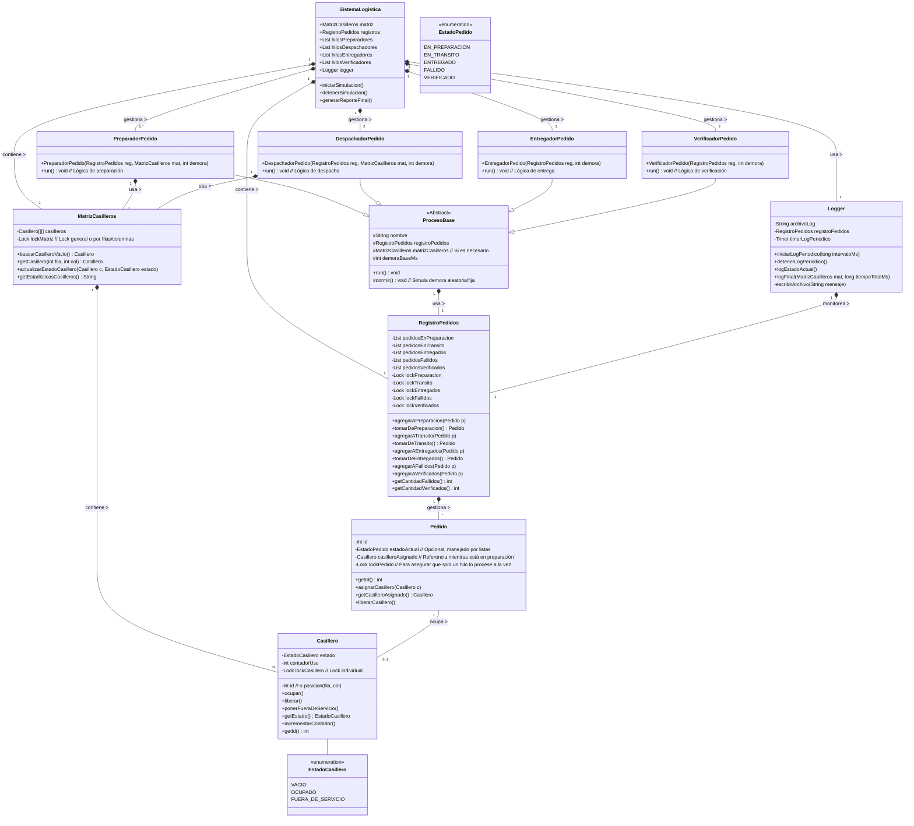

```mermaid
classDiagram
    class SistemaLogistica {
        +MatrizCasilleros matriz
        +RegistroPedidos registros
        +List<Thread> hilosPreparadores
        +List<Thread> hilosDespachadores
        +List<Thread> hilosEntregadores
        +List<Thread> hilosVerificadores
        +Logger logger
        +iniciarSimulacion()
        +detenerSimulacion()
        +generarReporteFinal()
    }

    class MatrizCasilleros {
        -Casillero[][] casilleros
        -Lock lockMatriz  // Lock general o por filas/columnas
        +buscarCasilleroVacio() Casillero
        +getCasillero(int fila, int col) Casillero
        +actualizarEstadoCasillero(Casillero c, EstadoCasillero estado)
        +getEstadisticasCasilleros() String
    }

    class Casillero {
        -int id  // o posicion (fila, col)
        -EstadoCasillero estado
        -int contadorUso
        -Lock lockCasillero // Lock individual
        +ocupar()
        +liberar()
        +ponerFueraDeServicio()
        +getEstado() EstadoCasillero
        +incrementarContador()
        +getId() int
    }

    class RegistroPedidos {
        -List<Pedido> pedidosEnPreparacion
        -List<Pedido> pedidosEnTransito
        -List<Pedido> pedidosEntregados
        -List<Pedido> pedidosFallidos
        -List<Pedido> pedidosVerificados
        -Lock lockPreparacion
        -Lock lockTransito
        -Lock lockEntregados
        -Lock lockFallidos
        -Lock lockVerificados
        +agregarAPreparacion(Pedido p)
        +tomarDePreparacion() Pedido
        +agregarATransito(Pedido p)
        +tomarDeTransito() Pedido
        +agregarAEntregados(Pedido p)
        +tomarDeEntregados() Pedido
        +agregarAFallidos(Pedido p)
        +agregarAVerificados(Pedido p)
        +getCantidadFallidos() int
        +getCantidadVerificados() int
    }

    class Pedido {
        -int id
        -EstadoPedido estadoActual // Opcional, manejado por listas
        -Casillero casilleroAsignado // Referencia mientras está en preparación
        -Lock lockPedido // Para asegurar que solo un hilo lo procese a la vez
        +getId() int
        +asignarCasillero(Casillero c)
        +getCasilleroAsignado() Casillero
        +liberarCasillero()
    }

    class ProcesoBase {
        <<Abstract>>
        #String nombre
        #RegistroPedidos registroPedidos
        #MatrizCasilleros matrizCasilleros // Si es necesario
        #int demoraBaseMs
        +run() void
        #dormir() void // Simula demora aleatoria/fija
    }

    class PreparadorPedido {
        +PreparadorPedido(RegistroPedidos reg, MatrizCasilleros mat, int demora)
        +run() void // Lógica de preparación
    }

    class DespachadorPedido {
        +DespachadorPedido(RegistroPedidos reg, MatrizCasilleros mat, int demora)
        +run() void // Lógica de despacho
    }

    class EntregadorPedido {
        +EntregadorPedido(RegistroPedidos reg, int demora)
        +run() void // Lógica de entrega
    }

    class VerificadorPedido {
        +VerificadorPedido(RegistroPedidos reg, int demora)
        +run() void // Lógica de verificación
    }

    class Logger {
        -String archivoLog
        -RegistroPedidos registroPedidos
        -Timer timerLogPeriodico
        +iniciarLogPeriodico(long intervaloMs)
        +detenerLogPeriodico()
        +logEstadoActual()
        +logFinal(MatrizCasilleros mat, long tiempoTotalMs)
        -escribirArchivo(String mensaje)
    }

    class EstadoCasillero {
        <<enumeration>>
        VACIO
        OCUPADO
        FUERA_DE_SERVICIO
    }

    class EstadoPedido {
        <<enumeration>>
        EN_PREPARACION
        EN_TRANSITO
        ENTREGADO
        FALLIDO
        VERIFICADO
    }

    SistemaLogistica "1" *-- "1" MatrizCasilleros : contiene >
    SistemaLogistica "1" *-- "1" RegistroPedidos : contiene >
    SistemaLogistica "1" *-- "1" Logger : usa >
    SistemaLogistica "1" *-- "3..*" PreparadorPedido : gestiona >
    SistemaLogistica "1" *-- "2" DespachadorPedido : gestiona >
    SistemaLogistica "1" *-- "3" EntregadorPedido : gestiona >
    SistemaLogistica "1" *-- "2" VerificadorPedido : gestiona >

    MatrizCasilleros "1" *-- "N" Casillero : contiene >

    RegistroPedidos "1" *-- "*" Pedido : gestiona >

    PreparadorPedido --|> ProcesoBase
    DespachadorPedido --|> ProcesoBase
    EntregadorPedido --|> ProcesoBase
    VerificadorPedido --|> ProcesoBase

    ProcesoBase "1" *-- "1" RegistroPedidos : usa >
    PreparadorPedido "1" *-- "1" MatrizCasilleros : usa >
    DespachadorPedido "1" *-- "1" MatrizCasilleros : usa >

    Pedido "1" -- "0..1" Casillero : ocupa >

    Casillero -- EstadoCasillero

    Logger "1" *-- "1" RegistroPedidos : monitorea >

```