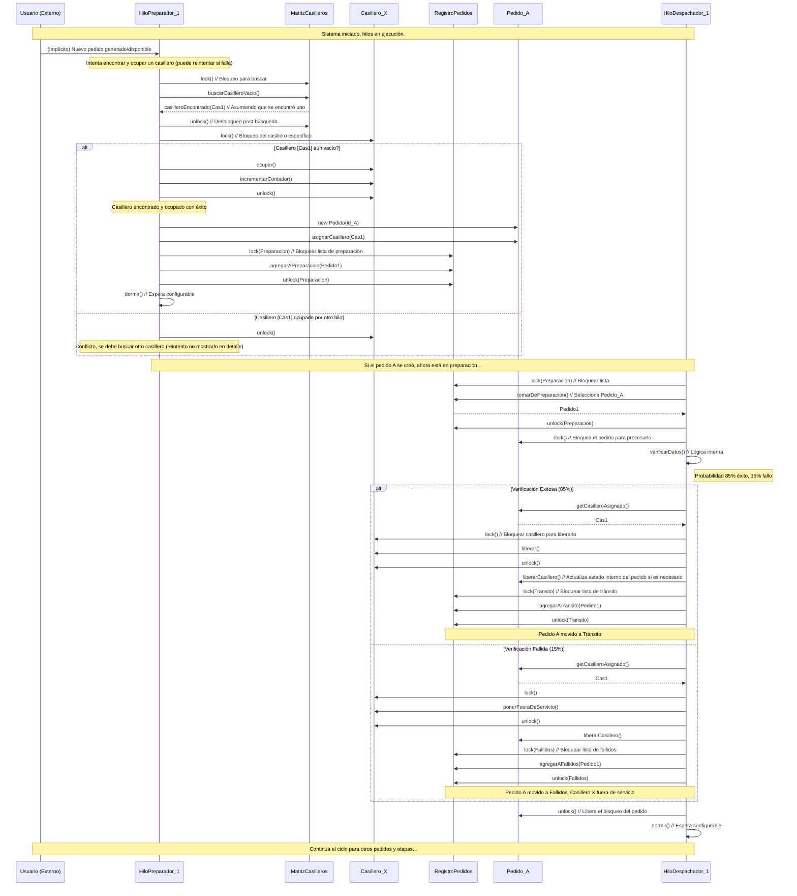

```mermaid
sequenceDiagram
    participant User as Usuario (Externo)
    participant Prep1 as HiloPreparador_1
    participant Matriz as MatrizCasilleros
    participant Cas1 as Casillero_X
    participant RegP as RegistroPedidos
    participant Pedido1 as Pedido_A
    participant Desp1 as HiloDespachador_1

    Note over User, Desp1: Sistema iniciado, hilos en ejecución.

    User ->> Prep1: (Implícito) Nuevo pedido generado/disponible

    Note over Prep1: Intenta encontrar y ocupar un casillero (puede reintentar si falla)

    Prep1 ->> Matriz: lock() // Bloqueo para buscar
    Prep1 ->> Matriz: buscarCasilleroVacio()
    Matriz -->> Prep1: casilleroEncontrado(Cas1) // Asumiendo que se encontró uno
    Prep1 ->> Matriz: unlock() // Desbloqueo post-búsqueda

    Prep1 ->> Cas1: lock() // Bloqueo del casillero específico
    alt Casillero [Cas1] aún vacío?
        Prep1 ->> Cas1: ocupar()
        Prep1 ->> Cas1: incrementarContador()
        Prep1 ->> Cas1: unlock()
        Note over Prep1: Casillero encontrado y ocupado con éxito

        Prep1 ->> Pedido1: new Pedido(id_A)
        Prep1 ->> Pedido1: asignarCasillero(Cas1)

        Prep1 ->> RegP: lock(Preparacion) // Bloquear lista de preparación
        Prep1 ->> RegP: agregarAPreparacion(Pedido1)
        Prep1 ->> RegP: unlock(Preparacion)

        Prep1 ->> Prep1: dormir() // Espera configurable

    else Casillero [Cas1] ocupado por otro hilo
        Prep1 ->> Cas1: unlock()
        Note over Prep1: Conflicto, se debe buscar otro casillero (reintento no mostrado en detalle)
    end

    Note over Prep1, Desp1: Si el pedido A se creó, ahora está en preparación...

   
    Desp1 ->> RegP: lock(Preparacion) // Bloquear lista
    Desp1 ->> RegP: tomarDePreparacion() // Selecciona Pedido_A
    RegP -->> Desp1: Pedido1
    Desp1 ->> RegP: unlock(Preparacion)

    Desp1 ->> Pedido1: lock() // Bloquea el pedido para procesarlo

    Desp1 ->> Desp1: verificarDatos() // Lógica interna
    Note right of Desp1: Probabilidad 85% éxito, 15% fallo

    alt Verificación Exitosa (85%)
        Desp1 ->> Pedido1: getCasilleroAsignado()
        Pedido1 -->> Desp1: Cas1

        Desp1 ->> Cas1: lock() // Bloquear casillero para liberarlo
        Desp1 ->> Cas1: liberar()
        Desp1 ->> Cas1: unlock()

        Desp1 ->> Pedido1: liberarCasillero() // Actualiza estado interno del pedido si es necesario

        Desp1 ->> RegP: lock(Transito) // Bloquear lista de tránsito
        Desp1 ->> RegP: agregarATransito(Pedido1)
        Desp1 ->> RegP: unlock(Transito)

        Note over Desp1, RegP: Pedido A movido a Tránsito

    else Verificación Fallida (15%)
        Desp1 ->> Pedido1: getCasilleroAsignado()
        Pedido1 -->> Desp1: Cas1

        Desp1 ->> Cas1: lock()
        Desp1 ->> Cas1: ponerFueraDeServicio()
        Desp1 ->> Cas1: unlock()

        Desp1 ->> Pedido1: liberarCasillero()

        Desp1 ->> RegP: lock(Fallidos) // Bloquear lista de fallidos
        Desp1 ->> RegP: agregarAFallidos(Pedido1)
        Desp1 ->> RegP: unlock(Fallidos)

        Note over Desp1, RegP: Pedido A movido a Fallidos, Casillero X fuera de servicio
    end

    Desp1 ->> Pedido1: unlock() // Libera el bloqueo del pedido

    Desp1 ->> Desp1: dormir() // Espera configurable

    Note over User, Desp1: Continúa el ciclo para otros pedidos y etapas...

``` 