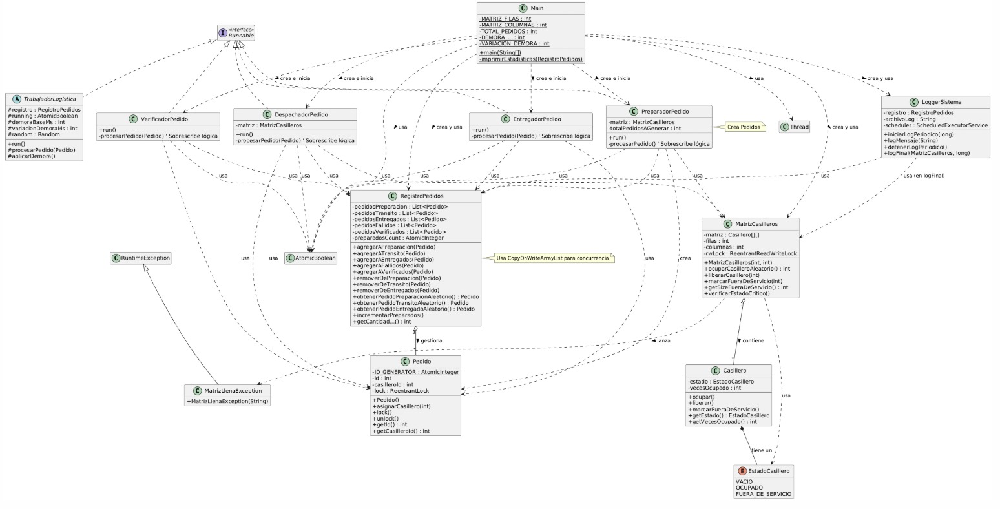
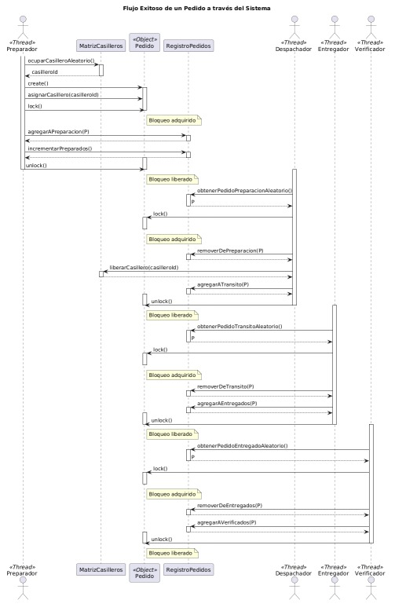

# Simulación Logística Concurrente

**Alumnos:**

- Angulo Baez, Salvador
- Arrieta, Gabriel
- Bejarano, Kevin
- Daniel, Tomas Gaston
- Vigezzi, Ignacio

**Grupo:**  
*NoEsThreadSafe*

**Institución Educativa**  
*Universidad Nacional de Córdoba - Facultad de Ciencias Exactas, Físicas y Naturales*

**Profesores**  
*Luis Ventre*  
*Mauricio Ludemann*
*Agustin Carranza*

## 1. Introducción

Este informe detalla el análisis de un conjunto de clases Java diseñadas para simular un proceso logístico complejo. La simulación modela el flujo de "Pedidos" a través de distintas etapas (Preparación, Despacho, Entrega, Verificación) utilizando un sistema de "Casilleros" como recurso compartido. Una característica fundamental del sistema es su naturaleza concurrente, donde múltiples hilos de ejecución ("trabajadores") operan simultáneamente en las diferentes etapas del proceso.

Los objetivos específicos de este proyecto incluyen:
*   Modelar y simular un flujo de trabajo logístico concurrente con múltiples etapas y recursos compartidos.
*   Implementar y evaluar el uso de diversos mecanismos de sincronización de Java para garantizar la integridad de los datos y la correcta coordinación entre hilos.
*   Analizar el comportamiento del sistema bajo parámetros configurables, como el número de trabajadores por etapa y la capacidad de los recursos.
*   Desarrollar un sistema de logging detallando el seguimiento en tiempo real y estado de la simulación.

## 2. Arquitectura General

La simulación sigue una arquitectura multi-hilo basada en el patrón Productor-Consumidor entre las distintas etapas:

*   **Entidades Centrales:**
    *   `Pedido`: Representa el objeto de datos que fluye por el sistema. Cada instancia contiene su propio bloqueo para garantizar la atomicidad de su procesamiento.
    *   `Casillero`: Modela el recurso físico limitado, gestionado por `MatrizCasilleros`.
*   **Gestores de Estado y Recursos:**
    *   `RegistroPedidos`: Actúa como el repositorio central y monitor de estado. Mantiene colecciones separadas y concurrentes (`CopyOnWriteArrayList`) para los pedidos según su estado actual (Preparación, Tránsito, Entregados, Verificados, Fallidos). Proporciona métodos seguros para que los trabajadores añadan, remuevan y obtengan pedidos.
    *   `MatrizCasilleros`: Gestiona la disponibilidad y estado de la cuadrícula de `Casillero`. Utiliza un `ReentrantReadWriteLock` para manejar el acceso concurrente de forma eficiente (permitiendo múltiples lectores simultáneos pero escrituras exclusivas). Es responsable de asignar y liberar casilleros.
*   **Trabajadores (Hilos):** Clases que implementan `Runnable`, cada una representando una etapa del proceso logístico y operando como consumidores de la etapa anterior y productores para la siguiente:
    *   `PreparadorPedido`: *Productor inicial*. Genera nuevos pedidos, busca y ocupa un casillero a través de `MatrizCasilleros`, y añade el pedido a la etapa de "Preparación" en `RegistroPedidos`.
    *   `DespachadorPedido`: *Consumidor* de "Preparación" y *Productor* para "Tránsito" o "Fallidos". Toma pedidos, simula el despacho (con probabilidad de fallo), interactúa con `MatrizCasilleros` para liberar o marcar como fuera de servicio el casillero, y actualiza el estado del pedido en `RegistroPedidos`.
    *   `EntregadorPedido`: *Consumidor* de "Tránsito" y *Productor* para "Entregados" o "Fallidos". Procesa pedidos en tránsito, simula la entrega (con probabilidad de fallo) y actualiza su estado.
    *   `VerificadorPedido`: *Consumidor* de "Entregados" y *Productor* para "Verificados" o "Fallidos". Realiza la verificación final simulada y actualiza el estado.
*   **Bucle Principal y Monitoreo:**
    *   `Main`: Punto de entrada de la aplicación. Es la responsable de:
        *   Leer/definir parámetros de configuración (tamaño de matriz, número de hilos por etapa, demoras, probabilidad de fallos, total de pedidos a generar).
        *   Inicializar los gestores (`MatrizCasilleros`, `RegistroPedidos`) y él `LoggerSistema`.
        *   Crear e iniciar todos los hilos trabajadores.
        *   Implementar la lógica de monitoreo y finalización: comprueba periódicamente si se alcanzó el objetivo de pedidos o si la matriz está llena (`MatrizLlenaException`), y señala la finalización a los trabajadores (usando `AtomicBoolean running`).
        *   Esperar (`join`) la finalización de todos los hilos trabajadores.
        *   Registrar el informe final a través del `LoggerSistema`.
    *   `LoggerSistema`: Utiliza un `ScheduledExecutorService` para registrar estadísticas clave del `RegistroPedidos` de forma periódica en un archivo de log (`simulacion_logistica.log`), permitiendo observar el progreso y comportamiento del sistema. También registra eventos importantes y un resumen final detallado.

## 3. Descripción de Componentes Principales

### 3.1. Entidades del Dominio

*   **`Pedido.java`**:
    *   Representa un pedido individual.
    *   Genera un ID único y atómico (`AtomicInteger`).
    *   Mantiene una referencia al `casilleroId` asignado.
    *   **Importante:** Contiene un `ReentrantLock` individual. Esto permite bloquear un pedido específico mientras un hilo trabajador lo procesa, siendo la principal garantía de atomicidad a nivel de pedido.
*   **`Casillero.java`**:
    *   Modela un casillero físico con estados definidos por `EstadoCasillero`.
    *   Controla las transiciones de estado (`ocupar`, `liberar`, `marcarFueraDeServicio`) con validaciones (`IllegalStateException`).
    *   Lleva una cuenta (`vecesOcupado`) de su uso.
*   **`EstadoCasillero.java` (enum)**:
    *   Define los estados posibles de un casillero: `VACIO`, `OCUPADO`, `FUERA_DE_SERVICIO`.

### 3.2. Gestores de Recursos y Estado

*   **`MatrizCasilleros.java`**:
    *   Gestiona una matriz 2D de `Casillero`.
    *   Proporciona métodos para `ocuparCasilleroAleatorio`, `liberarCasillero`, `marcarFueraDeServicio`.
    *   Utiliza un `ReentrantReadWriteLock` para controlar el acceso concurrente. Esto permite que múltiples hilos lean el estado de la matriz simultáneamente (usando el `readLock`), mejorando la concurrencia para operaciones de solo lectura. Sin embargo, las operaciones que modifican la matriz (ocupar, liberar, marcar fuera de servicio) deben adquirir el `writeLock`, asegurando acceso exclusivo y previniendo inconsistencias.
    *   El método `ocuparCasilleroAleatorio` implementa la siguiente estrategia de busqueda: primero, crea una lista aleatorizada de todas las posiciones posibles. Luego, itera sobre estas posiciones. Para minimizar el tiempo que se mantiene el costoso `writeLock`, inicialmente adquiere un `readLock`. Si, dentro del bucle, encuentra un casillero potencialmente `VACIO` (tras verificar su estado), el `readLock` se libera, se adquiere el `writeLock` para realizar la operación de `ocupar()` de forma segura, y luego, en un bloque `finally`, el `writeLock` se libera y el `readLock` se vuelve a adquirir para continuar la búsqueda si fuera necesario. Si no se encuentra ningún casillero vacío, devuelve -1.
    *   Implementa `verificarEstadoCritico` que, bajo un `readLock`, llama a `getSizeFueraDeServicio` para contar los casilleros no disponibles. Si todos los casilleros están fuera de servicio, lanza `MatrizLlenaException` para señalar una condición de parada de la simulación. El método `getSizeFueraDeServicio` en sí mismo no adquiere bloqueos, pero su uso dentro de `verificarEstadoCritico` garantiza que la lectura del estado de los casilleros sea consistente.
*   **`MatrizLlenaException.java`**:
    *   Excepción `RuntimeException` específica para indicar que la matriz está inutilizable.
*   **`RegistroPedidos.java`**:
    *   Almacena los pedidos en diferentes listas según su estado (`pedidosPreparacion`, `pedidosTransito`, etc.).
    *   Utiliza `CopyOnWriteArrayList` para estas listas. Esta elección se basa en la premisa de que las operaciones de lectura e iteración sobre estas listas (por ejemplo, trabajadores buscando pedidos, o el logger reportando estadísticas) son más frecuentes que las operaciones de escritura (añadir o remover pedidos). `CopyOnWriteArrayList` es una implementación thread-safe que logra la seguridad para lecturas concurrentes e iteraciones sin necesidad de bloqueos explícitos por parte del código cliente, ya que los iteradores operan sobre una copia instantánea e inmutable de la lista. La contrapartida es que cada operación de modificación (añadir, remover) incurre en el costo de crear una nueva copia del array subyacente, lo cual podría impactar el rendimiento si la tasa de modificaciones fuera extremadamente alta o las listas muy grandes. Para el alcance de esta simulación, se consideró un balance adecuado entre la seguridad y la simplicidad de uso.
    *   Proporciona métodos `agregarA...`, `removerDe...` y `obtenerPedido...Aleatorio`. La selección aleatoria de pedidos de las colas busca evitar que siempre se procesen los mismos pedidos si la producción supera al consumo.
    *   Mantiene un contador atómico (`AtomicInteger preparadosCount`) para el total de pedidos generados, garantizando la atomicidad de su incremento.

### 3.3. Trabajadores Concurrentes (`Runnable`)

Todos los trabajadores (`PreparadorPedido`, `DespachadorPedido`, `EntregadorPedido`, `VerificadorPedido`) comparten una estructura base:
*   Implementan `Runnable`.
*   Reciben referencias a los gestores necesarios (`RegistroPedidos`, `MatrizCasilleros`), parámetros de configuración (demoras) y la bandera `AtomicBoolean running`.
*   Su método `run()` contiene un bucle principal que se ejecuta mientras `running` es `true` y/o queden elementos en su cola de entrada (dependiendo de la lógica específica de cada trabajador para asegurar que se procesen todos los pedidos pendientes).
*   Dentro del bucle:
    1.  Obtienen un pedido de la etapa anterior desde `RegistroPedidos`.
    2.  Si obtienen un pedido:
        *   **Bloquean el pedido:** `pedido.lock();`
        *   **Procesan el pedido:** Realizan la lógica específica de su etapa (simular tiempo, actualizar estado, interactuar con `MatrizCasilleros` si aplica).
        *   **Actualizan `RegistroPedidos`:** Remueven el pedido de la lista origen y lo añaden a la lista destino (o fallidos).
        *   **Desbloquean el pedido:** `finally { pedido.unlock(); }`
    3.  Aplican una demora (`Thread.sleep`) para simular el tiempo de procesamiento.
*   Manejan `InterruptedException` para permitir una finalización limpia.

### 3.4. Orquestación y Utilidades

**`Main.java`**:
*   Define constantes o lee configuración para parámetros clave.
*   Inicializa todos los componentes compartidos.
*   Crea los `ThreadPools` (o hilos individuales) para cada tipo de trabajador y los inicia.
*   Implementa la lógica de control:
*   Monitorea las condiciones de finalización (total de pedidos alcanzado o `MatrizLlenaException`).
*   Establece `running.set(false)` para señalar a los trabajadores que deben terminar.
*   Espera (`join`) a que todos los hilos finalicen su trabajo pendiente.
*   Invoca al `LoggerSistema` para generar el informe final.
*   **`LoggerSistema.java`**:
    *   Proporciona una visión del estado interno de la simulación a lo largo del tiempo.
    *   Usa `ScheduledExecutorService` para tareas periódicas (estadísticas).
    *   Escribe logs en un archivo (`simulacion_logistica.log`) usando `PrintWriter`, asegurando el `flush` para visibilidad inmediata.
    *   El método `logFinal` resume las estadisticas mas importantes de la simulacion.

## 4. Estrategia de Concurrencia

La ejecución concurrente se basa en varios mecanismos:

1.  **Bloqueo a Nivel de Pedido (`Pedido.lock()`):** Es la garantía principal de **atomicidad por pedido**. Asegura que las operaciones sobre un `Pedido` específico sean realizadas por un solo hilo a la vez, evitando race conditions al moverlo entre etapas o modificar sus datos.
2.  **Bloqueo de Lectura/Escritura en `MatrizCasilleros`:** Optimiza el acceso a los casilleros. Permite consultas concurrentes (lectura) pero serializa las modificaciones (escritura), manteniendo la integridad de la matriz.
3.  **Colecciones Concurrentes (`CopyOnWriteArrayList` en `RegistroPedidos`):** Simplifica el manejo de las listas de pedidos, ofreciendo seguridad en lecturas e iteraciones sin bloqueos explícitos, adecuado para escenarios donde las lecturas superan ampliamente las escrituras.
4.  **Variables Atómicas (`AtomicInteger`, `AtomicBoolean`):** Garantizan operaciones indivisibles y visibilidad entre hilos para contadores simples (IDs, estadísticas) y banderas de control (`running`).
5.  **Modelo Productor-Consumidor:** La arquitectura general desacopla las etapas. Cada conjunto de trabajadores de una etapa consume la salida de la anterior y produce para la siguiente, usando `RegistroPedidos` como el buffer compartido y sincronizado.
6.  **Manejo Controlado de Hilos:** La creación, inicio, señalización de parada (`running` flag) y espera (`join`) en `Main` aseguran un ciclo de vida ordenado para los hilos trabajadores.

## 5. Flujo Típico de un Pedido (Caso Exitoso)

1.  **Preparación:** Un `PreparadorPedido` obtiene un `Casillero` de `MatrizCasilleros`, crea un `Pedido`, lo bloquea, lo asigna al casillero, lo añade a `pedidosPreparacion` en `RegistroPedidos`, y lo desbloquea.
2.  **Despacho:** Un `DespachadorPedido` obtiene el `Pedido` de `pedidosPreparacion`, lo bloquea, simula el despacho (exitoso), libera el `Casillero` vía `MatrizCasilleros`, lo mueve de `pedidosPreparacion` a `pedidosTransito` en `RegistroPedidos`, y lo desbloquea.
3.  **Entrega:** Un `EntregadorPedido` obtiene el `Pedido` de `pedidosTransito`, lo bloquea, simula la entrega (exitosa), lo mueve de `pedidosTransito` a `pedidosEntregados` en `RegistroPedidos`, y lo desbloquea.
4.  **Verificación:** Un `VerificadorPedido` obtiene el `Pedido` de `pedidosEntregados`, lo bloquea, simula la verificación (exitosa), lo mueve de `pedidosEntregados` a `pedidosVerificados` en `RegistroPedidos`, y lo desbloquea.

## 6. Configuración y Logging

*   **Configuración:** Los parámetros clave de la simulación están actualmente codificados como constantes `static final` en la clase `Main.java`. Esto permite modificar fácilmente el comportamiento de la simulación antes de la compilación. Los principales parámetros configurables incluyen:
    *   `NUM_PREPARADORES`, `NUM_DESPACHADORES`, `NUM_ENTREGADORES`, `NUM_VERIFICADORES`: Número de hilos para cada tipo de trabajador.
    *   `TOTAL_PEDIDOS_A_GENERAR`: Límite total de pedidos que los preparadores intentarán generar.
    *   `FILAS_MATRIZ`, `COLUMNAS_MATRIZ`: Dimensiones de la matriz de casilleros.
    *   `DEMORA_PREPARADOR`, `DEMORA_DESPACHADOR`, `DEMORA_ENTREGADOR`, `DEMORA_VERIFICADOR`: Tiempo base (en ms) para la simulación de cada operación.
    *   `VARIACION_DEMORA`: Rango de variación aleatoria (en ms) que se suma o resta al tiempo base de demora.
    *   `INTERVALO_LOG_MS`: Frecuencia con la que el `LoggerSistema` escribe el estado actual de la simulación en el archivo de log.
    *   `LOG_FILE_PATH`: Ruta y nombre del archivo de log.

*   **Logging:** `LoggerSistema` proporciona un registro persistente en `simulacion_logistica.log`, útil para el seguimiento del progreso durante la ejecución. Utiliza un `ScheduledExecutorService` para registrar periódicamente el estado de las colas de pedidos y el uso de casilleros.

## 7. Observaciones y Posibles Mejoras

*   **Concurrencia en `MatrizCasilleros.getSizeFueraDeServicio`:** Este método accede al estado de los casilleros sin adquirir explícitamente un bloqueo. Aunque es llamado por `verificarEstadoCritico` que sí tiene un `readLock`, sería más robusto si `getSizeFueraDeServicio` gestionara su propio `readLock` o si el conteo se realizara directamente dentro del bloque `readLock` de `verificarEstadoCritico`.
*   **Concurrencia en `RegistroPedidos.obtenerPedidoAleatorio`:** La secuencia de obtener tamaño, generar índice aleatorio y obtener el elemento de `CopyOnWriteArrayList` no es atómica en conjunto. Aunque el riesgo es bajo y la protección principal es el `pedido.lock()` posterior, existe una mínima posibilidad teórica de inconsistencia si la lista se modifica exactamente entre `size()` y `get()`.
*   **Rendimiento de `CopyOnWriteArrayList`:** Si las tasas de adición/eliminación de pedidos en `RegistroPedidos` fueran extremadamente altas, el rendimiento de `CopyOnWriteArrayList` podría degradarse debido a las copias frecuentes. En tal escenario, se podrían evaluar alternativas como `ConcurrentLinkedQueue` o `BlockingQueue` (requeriría ajustar la lógica de obtención de pedidos).
*   **Externalización de Configuración:** Para mayor flexibilidad, los parámetros de simulación definidos en `Main` podrían extraerse a un archivo de configuración externo (p.ej., `.properties`) o pasarse como argumentos de línea de comandos.
*   **Manejo de Errores:** El sistema maneja `IllegalStateException` en `Casillero` y `MatrizLlenaException`. Se podría considerar un manejo más detallado o estrategias de recuperación si fuera necesario.

## 8. Diagrama de Clases

## 9. Diagrama de Sequencia

## 10. Conclusión

El código representa una simulación concurrente bien estructurada de un proceso logístico. Emplea adecuadamente mecanismos de sincronización Java (`ReentrantLock`, `ReentrantReadWriteLock`, `Atomic*`, `CopyOnWriteArrayList`) para gestionar el acceso seguro a recursos y estados compartidos por múltiples hilos. El diseño modular con clases `Runnable` separadas para cada etapa facilita la comprensión y el mantenimiento. El sistema incluye configuración de parámetros, simulación de demoras/fallos y logging para análisis.