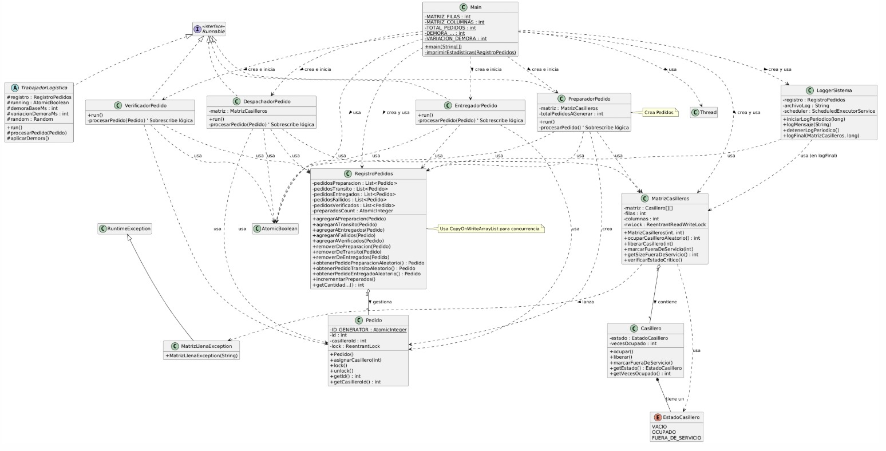
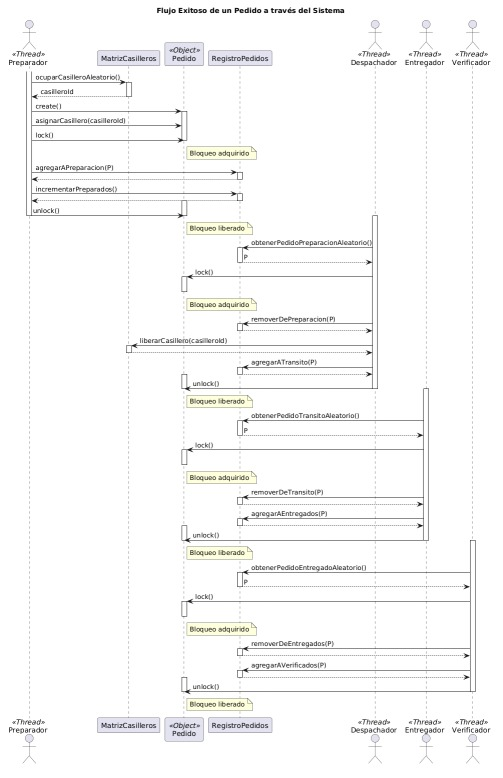

# Simulación Logística Concurrente

**Alumnos:**

- Angulo Baez, Salvador
- Arrieta, Gabriel
- Bejarano, Kevin
- Daniel, Tomas Gaston
- Vigezzi, Ignacio

**Grupo:**  
*NoEsThreadSafe*

**Institución Educativa**  
*Universidad Nacional de Córdoba - Facultad de Ciencias Exactas, Físicas y Naturales*

**Profesores**  
*Luis Ventre*  
*Mauricio Ludemann*
*Agustin Carranza*

## 1. Introducción

Este informe detalla el análisis de un conjunto de clases Java diseñadas para simular un proceso logístico complejo. La simulación modela el flujo de "Pedidos" a través de distintas etapas (Preparación, Despacho, Entrega, Verificación) utilizando un sistema de "Casilleros" como recurso compartido. Una característica fundamental del sistema es su naturaleza concurrente, donde múltiples hilos de ejecución ("trabajadores") operan simultáneamente en las diferentes etapas del proceso.

## 2. Arquitectura General

La simulación sigue una arquitectura multi-hilo basada en el patrón Productor-Consumidor entre las distintas etapas:

*   **Entidades Centrales:** `Pedido` (el objeto que fluye por el sistema) y `Casillero` (el recurso físico limitado).
*   **Gestores de Estado y Recursos:**
    *   `RegistroPedidos`: Actúa como el repositorio central, manteniendo listas separadas de pedidos según su estado actual (Preparación, Tránsito, Entregados, Verificados, Fallidos). Utiliza colecciones concurrentes para garantizar la seguridad en el acceso multi-hilo.
    *   `MatrizCasilleros`: Gestiona la cuadrícula de `Casillero`, controlando su ocupación, liberación y estado (incluyendo "Fuera de Servicio"). Utiliza bloqueos de lectura/escritura para manejar el acceso concurrente.
*   **Trabajadores (Hilos):** Clases que implementan `Runnable` y representan las diferentes operaciones logísticas:
    *   `PreparadorPedido`: Genera nuevos pedidos, busca y ocupa un casillero, y añade el pedido a la etapa de "Preparación".
    *   `DespachadorPedido`: Toma pedidos de "Preparación", simula el despacho (con probabilidad de fallo), libera o marca como fuera de servicio el casillero asociado, y mueve el pedido a "Tránsito" o "Fallidos".
    *   `EntregadorPedido`: Toma pedidos de "Tránsito", simula la entrega (con probabilidad de fallo), y mueve el pedido a "Entregados" o "Fallidos".
    *   `VerificadorPedido`: Toma pedidos de "Entregados", simula la verificación final (con probabilidad de fallo), y mueve el pedido a "Verificados" o "Fallidos".
*   **Orquestación y Monitoreo:**
    *   `Main`: Punto de entrada. Configura parámetros, inicializa los gestores, crea e inicia todos los hilos trabajadores, monitoriza el estado general y gestiona la finalización de la simulación.
    *   `LoggerSistema`: Registra eventos clave, estadísticas periódicas y un informe final en un archivo de log.

## 3. Descripción de Componentes Principales

### 3.1. Entidades del Dominio

*   **`Pedido.java`**:
    *   Representa un pedido individual.
    *   Genera un ID único y atómico (`AtomicInteger`).
    *   Mantiene una referencia al `casilleroId` asignado.
    *   **Crucial:** Contiene un `ReentrantLock` individual. Esto permite bloquear un pedido específico mientras un hilo trabajador lo procesa, siendo la principal garantía de atomicidad a nivel de pedido.
*   **`Casillero.java`**:
    *   Modela un casillero físico con estados definidos por `EstadoCasillero`.
    *   Controla las transiciones de estado (`ocupar`, `liberar`, `marcarFueraDeServicio`) con validaciones (`IllegalStateException`).
    *   Lleva una cuenta (`vecesOcupado`) de su uso.
*   **`EstadoCasillero.java` (enum)**:
    *   Define los estados posibles de un casillero: `VACIO`, `OCUPADO`, `FUERA_DE_SERVICIO`.

### 3.2. Gestores de Recursos y Estado

*   **`MatrizCasilleros.java`**:
    *   Gestiona una matriz 2D de `Casillero`.
    *   Proporciona métodos para `ocuparCasilleroAleatorio`, `liberarCasillero`, `marcarFueraDeServicio`.
    *   Utiliza un `ReentrantReadWriteLock` para controlar el acceso concurrente: múltiples lectores (p.ej., al verificar estado) pueden operar simultáneamente, pero las escrituras (ocupar, liberar, marcar) son exclusivas.
    *   Implementa `verificarEstadoCritico` para detectar si todos los casilleros están fuera de servicio, lanzando `MatrizLlenaException`.
*   **`MatrizLlenaException.java`**:
    *   Excepción `RuntimeException` específica para indicar que la matriz está inutilizable.
*   **`RegistroPedidos.java`**:
    *   Almacena los pedidos en diferentes listas según su estado (`pedidosPreparacion`, `pedidosTransito`, etc.).
    *   Utiliza `CopyOnWriteArrayList` para estas listas, una implementación thread-safe eficiente para lecturas frecuentes e iteraciones, pero potencialmente costosa para escrituras.
    *   Proporciona métodos `agregarA...`, `removerDe...` y `obtenerPedido...Aleatorio`.
    *   Mantiene un contador atómico (`AtomicInteger preparadosCount`) para el total de pedidos generados.

### 3.3. Trabajadores Concurrentes (`Runnable`)

Todos los trabajadores comparten una estructura similar:
*   Implementan `Runnable` para ser ejecutados por `Thread`.
*   Reciben dependencias (`RegistroPedidos`, `MatrizCasilleros` si es necesario), parámetros de demora y la bandera `AtomicBoolean running`.
*   El método `run()` contiene un bucle principal que se ejecuta mientras `running` es `true` o mientras queden pedidos en su etapa de entrada.
*   Obtienen un pedido de la etapa anterior (usando `RegistroPedidos`).
*   **Bloquean el pedido (`pedido.lock()`)** antes de procesarlo.
*   Realizan la lógica específica de su etapa (interactuando con `RegistroPedidos` y `MatrizCasilleros`).
*   **Desbloquean el pedido (`pedido.unlock()`)** en un bloque `finally`.
*   Aplican una demora aleatoria (`aplicarDemora`) para simular el tiempo de procesamiento.

*   **`PreparadorPedido.java`**: Genera pedidos, ocupa casilleros, añade a `pedidosPreparacion`.
*   **`DespachadorPedido.java`**: Procesa `pedidosPreparacion`, libera/inhabilita casilleros, añade a `pedidosTransito` o `pedidosFallidos`.
*   **`EntregadorPedido.java`**: Procesa `pedidosTransito`, añade a `pedidosEntregados` o `pedidosFallidos`.
*   **`VerificadorPedido.java`**: Procesa `pedidosEntregados`, añade a `pedidosVerificados` o `pedidosFallidos`.

### 3.4. Orquestación y Utilidades

*   **`Main.java`**:
    *   Define constantes de configuración (tamaño matriz, nº hilos, demoras, total pedidos, probabilidades).
    *   Inicializa `MatrizCasilleros`, `RegistroPedidos`, `LoggerSistema` y `AtomicBoolean running`.
    *   Crea y arranca múltiples instancias de cada tipo de trabajador en hilos separados.
    *   Inicia un hilo "Monitor" adicional que imprime estadísticas periódicamente y establece `running` a `false` cuando se cumple la condición de finalización (todos los pedidos procesados o matriz llena).
    *   Espera (`join`) a que todos los hilos terminen.
    *   Imprime resultados finales y llama al `logFinal` del logger.
*   **`LoggerSistema.java`**:
    *   Utiliza un `ScheduledExecutorService` para escribir estadísticas periódicas (`getCantidadFallidos`, `getCantidadVerificados`) en un archivo (`simulacion_logistica.log`).
    *   Permite registrar mensajes individuales (`logMensaje`).
    *   Escribe un informe final (`logFinal`) con estadísticas completas al terminar la simulación.

## 4. Estrategia de Concurrencia

La correcta ejecución concurrente se basa en varios mecanismos:

1.  **Bloqueo a Nivel de Pedido:** El uso de un `ReentrantLock` **dentro de cada objeto `Pedido`** es la piedra angular. Asegura que solo un hilo trabajador puede modificar el estado o los datos asociados a un pedido específico en un momento dado, previniendo condiciones de carrera cuando múltiples despachadores, entregadores, etc., podrían intentar procesar el mismo pedido.
2.  **Bloqueo de Lectura/Escritura en Matriz:** El `ReentrantReadWriteLock` en `MatrizCasilleros` permite un acceso concurrente eficiente a la matriz. Múltiples hilos pueden leer el estado de los casilleros simultáneamente (p.ej., al buscar uno vacío o verificar el estado crítico), pero las operaciones que modifican la matriz (ocupar, liberar, marcar fuera de servicio) requieren un bloqueo exclusivo de escritura.
3.  **Colecciones Concurrentes:** `RegistroPedidos` utiliza `CopyOnWriteArrayList` para sus listas. Esto garantiza que la iteración sobre las listas y las lecturas (`size()`, `get()`) sean seguras frente a modificaciones concurrentes, aunque las operaciones de modificación (`add`, `remove`) pueden ser costosas ya que implican copiar la estructura subyacente.
4.  **Variables Atómicas:** Se usan `AtomicInteger` (para IDs de pedido y contador de preparados) y `AtomicBoolean` (para la bandera `running`) para garantizar operaciones atómicas y visibilidad entre hilos para estos contadores y banderas simples.
5.  **Modelo de Hilos:** Se crean múltiples hilos para cada tipo de tarea (`Preparador`, `Despachador`, etc.), permitiendo un procesamiento paralelo real de las diferentes etapas y pedidos.

## 5. Flujo Típico de un Pedido (Caso Exitoso)

1.  Un `PreparadorPedido` crea un `Pedido`, encuentra y ocupa un `Casillero` vía `MatrizCasilleros`, y lo añade a `pedidosPreparacion` en `RegistroPedidos`.
2.  Un `DespachadorPedido` obtiene el `Pedido` de `pedidosPreparacion`, lo bloquea, libera el `Casillero` asociado (vía `MatrizCasilleros`), lo elimina de `pedidosPreparacion` y lo añade a `pedidosTransito` en `RegistroPedidos`. Desbloquea el pedido.
3.  Un `EntregadorPedido` obtiene el `Pedido` de `pedidosTransito`, lo bloquea, lo elimina de `pedidosTransito` y lo añade a `pedidosEntregados`. Desbloquea el pedido.
4.  Un `VerificadorPedido` obtiene el `Pedido` de `pedidosEntregados`, lo bloquea, lo elimina de `pedidosEntregados` y lo añade a `pedidosVerificados`. Desbloquea el pedido.

*Nota: En caso de fallo simulado en Despacho, Entrega o Verificación, el pedido iría a la lista `pedidosFallidos` y, en el caso del Despacho, el casillero se marcaría como `FUERA_DE_SERVICIO`.*

## 6. Configuración y Logging

*   **Configuración:** Los parámetros clave de la simulación (tamaños, número de hilos, demoras, probabilidades) están actualmente codificados como constantes `static final` en la clase `Main`.
*   **Logging:** `LoggerSistema` proporciona un registro persistente en `simulacion_logistica.log`, útil para análisis post-mortem y seguimiento del progreso durante la ejecución.

## 7. Observaciones y Posibles Mejoras

*   **Concurrencia en `MatrizCasilleros.getSizeFueraDeServicio`:** Este método accede al estado de los casilleros sin adquirir explícitamente un bloqueo. Aunque es llamado por `verificarEstadoCritico` que sí tiene un `readLock`, sería más robusto si `getSizeFueraDeServicio` gestionara su propio `readLock` o si el conteo se realizara directamente dentro del bloque `readLock` de `verificarEstadoCritico`.
*   **Concurrencia en `RegistroPedidos.obtenerPedidoAleatorio`:** La secuencia de obtener tamaño, generar índice aleatorio y obtener el elemento de `CopyOnWriteArrayList` no es atómica en conjunto. Aunque el riesgo es bajo y la protección principal es el `pedido.lock()` posterior, existe una mínima posibilidad teórica de inconsistencia si la lista se modifica exactamente entre `size()` y `get()`.
*   **Rendimiento de `CopyOnWriteArrayList`:** Si las tasas de adición/eliminación de pedidos en `RegistroPedidos` fueran extremadamente altas, el rendimiento de `CopyOnWriteArrayList` podría degradarse debido a las copias frecuentes. En tal escenario, se podrían evaluar alternativas como `ConcurrentLinkedQueue` o `BlockingQueue` (requeriría ajustar la lógica de obtención de pedidos).
*   **Externalización de Configuración:** Para mayor flexibilidad, los parámetros de simulación definidos en `Main` podrían extraerse a un archivo de configuración externo (p.ej., `.properties`) o pasarse como argumentos de línea de comandos.
*   **Manejo de Errores:** El sistema maneja `IllegalStateException` en `Casillero` y `MatrizLlenaException`. Se podría considerar un manejo más detallado o estrategias de recuperación si fuera necesario.

## 8. Diagrama de Clases

## 9. Diagrama de Sequencia

## 8. Conclusión

El código representa una simulación concurrente bien estructurada de un proceso logístico. Emplea adecuadamente mecanismos de sincronización Java (`ReentrantLock`, `ReentrantReadWriteLock`, `Atomic*`, `CopyOnWriteArrayList`) para gestionar el acceso seguro a recursos y estados compartidos por múltiples hilos. El diseño modular con clases `Runnable` separadas para cada etapa facilita la comprensión y el mantenimiento. El sistema incluye configuración de parámetros, simulación de demoras/fallos y logging para análisis.