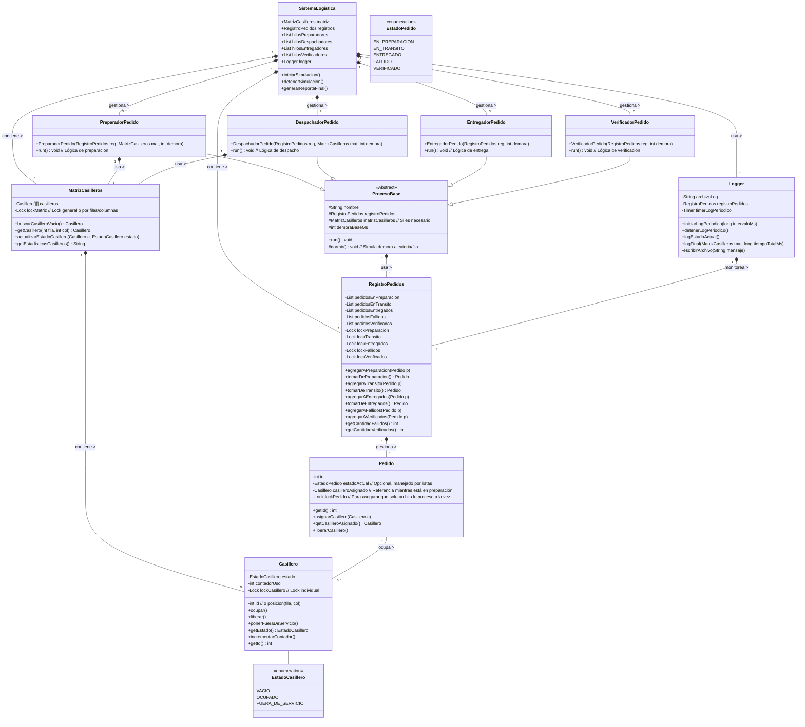
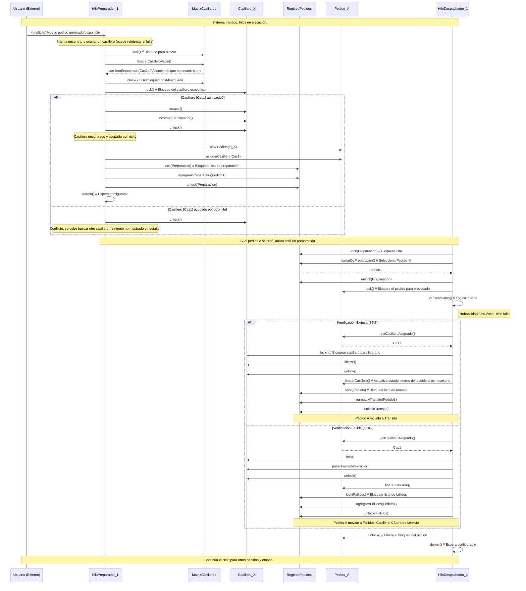

# Resumen del Proyecto

```
ProgConcu-Mio/
  |-- README.md
  |-- generate_sumary.py
  |-- simulacion_logistica.log
Codigo/
  |-- Casillero.java
  |-- DespachadorPedido.java
  |-- EntregadorPedido.java
  |-- EstadoCasillero.java
  |-- LoggerSistema.java
  |-- Main.java
  |-- MatrizCasilleros.java
  |-- Pedido.java
  |-- PreparadorPedido.java
  |-- RegistroPedidos.java
  |-- VerificadorPedido.java
Graficos/
  |-- Diagramas/
    |-- DiagramaDeClases.mmd
    |-- diagramaDeSequencia.mmd
```

---

## Contenido de Archivos

### `generate_sumary.py`

```python
import os
import fnmatch # Para patrones de archivos/directorios

# --- Configuración ---
OUTPUT_FILENAME = "project_summary.md"
START_DIR = "."  # Directorio actual (asume que se ejecuta desde TP2/)

# Extensiones de archivo cuyo contenido queremos incluir
CONTENT_EXTENSIONS = {".py", ".c", ".h", ".asm", ".java", ".mmd", ".log"} 
# Archivos específicos (sin extensión o nombre exacto) cuyo contenido incluir
CONTENT_FILENAMES = {"Makefile"}

# Lenguajes para bloques de código Markdown (aproximado)
LANGUAGE_HINTS = {
    ".py": "python",
    ".c": "c",
    ".h": "c",
    ".asm": "assembly",
    "Makefile": "makefile",
    ".java": "java",
    ".mmd": "markdown",
    ".log": "log",
}

# Directorios a ignorar completamente
IGNORE_DIRS = {"venv", "__pycache__", ".git", "obj", "lib", "bin"}
# Archivos específicos a ignorar
IGNORE_FILES = {OUTPUT_FILENAME, ".gitignore", "generate_summary.py"} 
# Patrones de archivos a ignorar (usando fnmatch)
IGNORE_PATTERNS = {"*.pyc", "*.o", "*.so", "*.out", "*~", "debug_app"}

# Máxima profundidad de directorios a mostrar (ajustable)
MAX_DEPTH = 5 
# Tamaño máximo de archivo para incluir contenido (en bytes, para evitar archivos enormes)
MAX_FILE_SIZE_CONTENT = 50 * 1024 # 50 KB

# --- Funciones ---

def should_ignore(name, path, is_dir):
    """Verifica si un archivo o directorio debe ser ignorado."""
    base_name = os.path.basename(path)
    if is_dir:
        return base_name in IGNORE_DIRS
    else:
        if base_name in IGNORE_FILES:
            return True
        for pattern in IGNORE_PATTERNS:
            if fnmatch.fnmatch(base_name, pattern):
                return True
        return False

def get_language_hint(filename):
    """Obtiene la pista de lenguaje para Markdown basada en la extensión o nombre."""
    if filename in CONTENT_FILENAMES:
        return LANGUAGE_HINTS.get(filename, "")
    _, ext = os.path.splitext(filename)
    return LANGUAGE_HINTS.get(ext, "")

# --- Script Principal ---

try:
    with open(OUTPUT_FILENAME, "w", encoding="utf-8") as md_file:
        md_file.write(f"# Resumen del Proyecto\n\n")
        md_file.write("```\n") # Bloque para la estructura de árbol inicial
        
        tree_structure = []
        for dirpath, dirnames, filenames in os.walk(START_DIR, topdown=True):
            # Ignorar directorios especificados (modifica dirnames in-place)
            dirnames[:] = [d for d in dirnames if not should_ignore(d, os.path.join(dirpath, d), True)]
            
            relative_path = os.path.relpath(dirpath, START_DIR)
            depth = relative_path.count(os.sep) if relative_path != '.' else 0

            if depth > MAX_DEPTH:
                dirnames[:] = [] # No seguir descendiendo
                continue

            indent = "  " * depth
            dir_prefix = "|-- " if depth > 0 else ""
            display_name = os.path.basename(dirpath) if relative_path != '.' else "ProgConcu-Mio"
            tree_structure.append(f"{indent}{dir_prefix}{display_name}/")

            # Ignorar archivos especificados
            valid_files = sorted([f for f in filenames if not should_ignore(f, os.path.join(dirpath, f), False)])
            
            file_indent = "  " * (depth + 1)
            for filename in valid_files:
                 tree_structure.append(f"{file_indent}|-- {filename}")

        md_file.write("\n".join(tree_structure))
        md_file.write("\n```\n\n") # Fin del bloque de árbol

        md_file.write("---\n\n")
        md_file.write("## Contenido de Archivos\n\n")

        # Segunda pasada para escribir contenido
        for dirpath, dirnames, filenames in os.walk(START_DIR, topdown=True):
            # Ignorar directorios (de nuevo)
            dirnames[:] = [d for d in dirnames if not should_ignore(d, os.path.join(dirpath, d), True)]

            relative_path = os.path.relpath(dirpath, START_DIR)
            depth = relative_path.count(os.sep) if relative_path != '.' else 0
            
            if depth > MAX_DEPTH:
                 dirnames[:] = []
                 continue

            # Ignorar archivos
            valid_files = sorted([f for f in filenames if not should_ignore(f, os.path.join(dirpath, f), False)])

            for filename in valid_files:
                file_path = os.path.join(dirpath, filename)
                _, ext = os.path.splitext(filename)
                
                # Comprobar si debemos incluir el contenido
                include_content = (ext in CONTENT_EXTENSIONS or filename in CONTENT_FILENAMES)
                
                if include_content:
                    relative_file_path = os.path.relpath(file_path, START_DIR).replace("\\", "/") # Normalizar separadores
                    md_file.write(f"### `{relative_file_path}`\n\n")
                    
                    try:
                        file_size = os.path.getsize(file_path)
                        if file_size == 0:
                             md_file.write("*Archivo vacío.*\n\n")
                             continue
                        if file_size > MAX_FILE_SIZE_CONTENT:
                            md_file.write(f"*Archivo demasiado grande ({file_size / 1024:.1f} KB) para incluir contenido completo.*\n\n")
                            continue
                            
                        with open(file_path, "r", encoding="utf-8") as f:
                            content = f.read()
                            lang = get_language_hint(filename)
                            md_file.write(f"```{lang}\n")
                            md_file.write(content)
                            md_file.write("\n```\n\n")
                    except UnicodeDecodeError:
                         md_file.write(f"*No se pudo leer el archivo (error de codificación). Podría ser un binario.*\n\n")
                    except Exception as e:
                        md_file.write(f"*Error al leer el archivo: {e}*\n\n")
                    
                    md_file.write("---\n\n") # Separador entre archivos

    print(f"¡Resumen generado exitosamente en '{OUTPUT_FILENAME}'!")

except Exception as e:
    print(f"Ocurrió un error al generar el resumen: {e}")
```

---

### `simulacion_logistica.log`

*Archivo vacío.*

### `Codigo/Casillero.java`

```java
// --- Clases de Datos ---
// Casillero.java
import java.util.concurrent.atomic.AtomicInteger;
import java.util.concurrent.locks.ReentrantLock; // Aunque no lo usemos activamente aquí si bloqueamos en Matriz

public class Casillero {
    private final int id;
    private volatile EstadoCasillero estado; // volatile para visibilidad entre hilos
    private final AtomicInteger contadorUso = new AtomicInteger(0);
    // Lock individual podría ser útil para operaciones atómicas complejas,
    // pero por simplicidad, bloquearemos en MatrizCasilleros.
    // private final ReentrantLock lock = new ReentrantLock();

    public Casillero(int id) {
        this.id = id;
        this.estado = EstadoCasillero.VACIO;
    }

    public int getId() { return id; }
    public EstadoCasillero getEstado() { return estado; }
    public int getContadorUso() { return contadorUso.get(); }

    // Las actualizaciones de estado y contador se harán desde MatrizCasilleros
    // bajo el bloqueo de la matriz para asegurar atomicidad en las operaciones
    // que involucran búsqueda y actualización.
    void ocupar() {
        this.estado = EstadoCasillero.OCUPADO;
        this.contadorUso.incrementAndGet();
    }

    void liberar() {
        this.estado = EstadoCasillero.VACIO;
    }

    void ponerFueraDeServicio() {
        this.estado = EstadoCasillero.FUERA_DE_SERVICIO;
    }

    @Override
    public String toString() {
        return "Casillero [id=" + id + ", estado=" + estado + ", usos=" + contadorUso.get() + "]";
    }
}
```

---

### `Codigo/DespachadorPedido.java`

```java
// DespachadorPedido.java
import java.util.Random;
import java.util.concurrent.atomic.AtomicBoolean;

public class DespachadorPedido implements Runnable {
    private final RegistroPedidos registro;
    private final MatrizCasilleros matriz;
    private final int demoraBaseMs;
    private final int variacionDemoraMs;
    private final double probExito;
    private final Random random = new Random();
    private final AtomicBoolean running;

    public DespachadorPedido(RegistroPedidos reg, MatrizCasilleros mat, int demoraBase, int variacion, double probExito, AtomicBoolean running) {
        this.registro = reg;
        this.matriz = mat;
        this.demoraBaseMs = demoraBase;
        this.variacionDemoraMs = variacion;
        this.probExito = probExito;
        this.running = running;
    }

    @Override
    public void run() {
         System.out.println(Thread.currentThread().getName() + " iniciado.");
        try {
            // Continuar mientras esté corriendo o haya pedidos por procesar en la cola anterior
            while (running.get() || !registro.pedidosEnPreparacion.isEmpty()) {
                Pedido pedido = registro.tomarDePreparacion();
                if (pedido != null) {
                    // Bloquear el pedido específico
                    pedido.lock();
                    try {
                        boolean exito = random.nextDouble() < probExito;
                        int casilleroId = pedido.getCasilleroIdAsignado();

                        if (exito) {
                            // Éxito: Liberar casillero, mover a tránsito
                            matriz.liberarCasillero(casilleroId);
                            pedido.liberarCasillero(); // Quitar referencia interna
                            registro.agregarATransito(pedido);
                            //System.out.println(Thread.currentThread().getName() + " despachó con éxito " + pedido);
                        } else {
                            // Fallo: Poner casillero fuera de servicio, mover a fallidos
                            matriz.ponerFueraDeServicio(casilleroId);
                            pedido.liberarCasillero();
                            registro.agregarAFallidos(pedido);
                             //System.out.println(Thread.currentThread().getName() + " falló despacho de " + pedido + ". Casillero " + casilleroId + " fuera de servicio.");
                        }
                    } finally {
                        pedido.unlock(); // Siempre liberar el lock del pedido
                    }
                    dormir(); // Dormir después de procesar un pedido
                } else if (running.get()) {
                    // Si no hay pedidos y la simulación sigue, esperar un poco
                    Thread.sleep(20);
                }
                 // Si !running.get() y la cola está vacía, el bucle terminará
            }
        } catch (InterruptedException e) {
            Thread.currentThread().interrupt();
             System.out.println(Thread.currentThread().getName() + " interrumpido.");
        }
         System.out.println(Thread.currentThread().getName() + " terminado.");
    }

     private void dormir() throws InterruptedException {
        int demora = demoraBaseMs + (variacionDemoraMs > 0 ? random.nextInt(variacionDemoraMs * 2 + 1) - variacionDemoraMs : 0);
        Thread.sleep(Math.max(0, demora));
    }
}
```

---

### `Codigo/EntregadorPedido.java`

```java
// EntregadorPedido.java
import java.util.Random;
import java.util.concurrent.atomic.AtomicBoolean;

public class EntregadorPedido implements Runnable {
    private final RegistroPedidos registro;
    private final int demoraBaseMs;
    private final int variacionDemoraMs;
    private final double probExito;
    private final Random random = new Random();
    private final AtomicBoolean running;

    public EntregadorPedido(RegistroPedidos reg, int demoraBase, int variacion, double probExito, AtomicBoolean running) {
        this.registro = reg;
        this.demoraBaseMs = demoraBase;
        this.variacionDemoraMs = variacion;
        this.probExito = probExito;
        this.running = running;
    }

     @Override
    public void run() {
         System.out.println(Thread.currentThread().getName() + " iniciado.");
         try {
            while (running.get() || !registro.pedidosEnTransito.isEmpty()) {
                Pedido pedido = registro.tomarDeTransito();
                if (pedido != null) {
                    pedido.lock();
                    try {
                        boolean exito = random.nextDouble() < probExito;
                        if (exito) {
                            registro.agregarAEntregados(pedido);
                           // System.out.println(Thread.currentThread().getName() + " entregó con éxito " + pedido);
                        } else {
                            registro.agregarAFallidos(pedido);
                            //System.out.println(Thread.currentThread().getName() + " falló entrega de " + pedido);
                        }
                    } finally {
                        pedido.unlock();
                    }
                    dormir();
                } else if (running.get()){
                     Thread.sleep(20);
                }
            }
        } catch (InterruptedException e) {
            Thread.currentThread().interrupt();
            System.out.println(Thread.currentThread().getName() + " interrumpido.");
        }
         System.out.println(Thread.currentThread().getName() + " terminado.");
    }

     private void dormir() throws InterruptedException {
        int demora = demoraBaseMs + (variacionDemoraMs > 0 ? random.nextInt(variacionDemoraMs * 2 + 1) - variacionDemoraMs : 0);
        Thread.sleep(Math.max(0, demora));
    }
}
```

---

### `Codigo/EstadoCasillero.java`

```java
// --- Enums ---
// EstadoCasillero.java
public enum EstadoCasillero {
    VACIO, OCUPADO, FUERA_DE_SERVICIO
}
```

---

### `Codigo/LoggerSistema.java`

```java

// --- Clase de Logging ---
// LoggerSistema.java
import java.io.FileWriter;
import java.io.IOException;
import java.io.PrintWriter;
import java.util.concurrent.Executors;
import java.util.concurrent.ScheduledExecutorService;
import java.util.concurrent.TimeUnit;
import java.time.LocalDateTime;
import java.time.format.DateTimeFormatter;

public class LoggerSistema {
    private final RegistroPedidos registro;
    private final String archivoLog;
    private ScheduledExecutorService scheduler;
    private PrintWriter writer;
    private static final DateTimeFormatter dtf = DateTimeFormatter.ofPattern("yyyy-MM-dd HH:mm:ss.SSS");

    public LoggerSistema(RegistroPedidos registro, String archivoLog) {
        this.registro = registro;
        this.archivoLog = archivoLog;
    }

    public void iniciarLogPeriodico(long intervaloMs) {
        try {
            // Append mode true
            writer = new PrintWriter(new FileWriter(archivoLog, true), true); // Aut flush true
            scheduler = Executors.newSingleThreadScheduledExecutor();

            Runnable tareaLog = () -> {
                String timestamp = dtf.format(LocalDateTime.now());
                int fallidos = registro.getCantidadFallidos();
                int verificados = registro.getCantidadVerificados();
                writer.println(String.format("%s - Fallidos: %d, Verificados: %d", timestamp, fallidos, verificados));
            };

            scheduler.scheduleAtFixedRate(tareaLog, 0, intervaloMs, TimeUnit.MILLISECONDS);
             logMensaje("Logger periódico iniciado. Escribiendo en: " + archivoLog);

        } catch (IOException e) {
            System.err.println("Error al iniciar el logger: " + e.getMessage());
            if (writer != null) writer.close();
             scheduler = null; // No iniciar si falla el archivo
        }
    }

    public void logMensaje(String mensaje) {
         if (writer != null) {
              String timestamp = dtf.format(LocalDateTime.now());
              writer.println(timestamp + " - " + mensaje);
         } else {
             System.out.println("LOG (consola): " + mensaje); // Fallback a consola
         }
    }


    public void detenerLogPeriodico() {
        if (scheduler != null && !scheduler.isShutdown()) {
            scheduler.shutdown();
            try {
                if (!scheduler.awaitTermination(5, TimeUnit.SECONDS)) {
                    scheduler.shutdownNow();
                }
            } catch (InterruptedException e) {
                scheduler.shutdownNow();
                Thread.currentThread().interrupt();
            }
        }
         logMensaje("Logger periódico detenido.");
    }

     public void logFinal(MatrizCasilleros matriz, long tiempoTotalMs) {
        logMensaje("--- INFORME FINAL ---");
        logMensaje("Tiempo total de ejecución: " + tiempoTotalMs + " ms (" + tiempoTotalMs / 1000.0 + " segundos)");
        logMensaje("Total Pedidos Fallidos: " + registro.getCantidadFallidos());
        logMensaje("Total Pedidos Verificados: " + registro.getCantidadVerificados());
        logMensaje(matriz.getEstadisticas());
        logMensaje("Pedidos restantes en Preparación: " + registro.getCantidadEnPreparacion());
        logMensaje("Pedidos restantes en Tránsito: " + registro.getCantidadEnTransito());
        logMensaje("Pedidos restantes Entregados: " + registro.getCantidadEntregados());
        int totalFinal = registro.getCantidadFallidos() + registro.getCantidadVerificados();
        logMensaje("Total Pedidos Procesados (Fallidos + Verificados): " + totalFinal);
        logMensaje("--- FIN INFORME ---");

         if (writer != null) {
             writer.close(); // Cerrar el archivo al final
         }
    }
}

```

---

### `Codigo/Main.java`

```java
// --- Clase Principal ---
// Main.java
import java.util.ArrayList;
import java.util.List;
import java.util.concurrent.ExecutorService;
import java.util.concurrent.Executors;
import java.util.concurrent.TimeUnit;
import java.util.concurrent.atomic.AtomicBoolean;

public class Main {

    // --- Configuración ---
    private static final int NUM_CASILLEROS = 200;
    private static final int TOTAL_PEDIDOS_A_PROCESAR = 500;

    private static final int NUM_PREPARADORES = 3;
    private static final int NUM_DESPACHADORES = 2;
    private static final int NUM_ENTREGADORES = 3;
    private static final int NUM_VERIFICADORES = 2;

    // Tiempos de demora base (ms) - AJUSTAR PARA OBTENER 15-30 SEGUNDOS
    private static final int DEMORA_BASE_PREPARADOR = 25; // Más rápido para generar carga
    private static final int DEMORA_BASE_DESPACHADOR = 45;
    private static final int DEMORA_BASE_ENTREGADOR = 35;
    private static final int DEMORA_BASE_VERIFICADOR = 55; // Potencial cuello de botella

    // Variación aleatoria de la demora (+/- ms)
    private static final int VARIACION_DEMORA = 10;

    // Probabilidades
    private static final double PROB_DESPACHO_OK = 0.85;
    private static final double PROB_ENTREGA_OK = 0.90;
    private static final double PROB_VERIFICACION_OK = 0.95;

    // Logger
    private static final long INTERVALO_LOG_MS = 200;
    private static final String ARCHIVO_LOG = "simulacion_logistica.log";

    public static void main(String[] args) {
        System.out.println("Iniciando simulación logística...");
        long startTime = System.nanoTime();

        // 1. Crear Recursos Compartidos
        MatrizCasilleros matriz = new MatrizCasilleros(NUM_CASILLEROS);
        RegistroPedidos registro = new RegistroPedidos();
        LoggerSistema logger = new LoggerSistema(registro, ARCHIVO_LOG);

        // 2. Iniciar Logger Periódico
        logger.iniciarLogPeriodico(INTERVALO_LOG_MS);

        // 3. Crear y Ejecutar Hilos usando ExecutorService
        //    Usamos un flag atómico para señalar cuándo detenerse.
        AtomicBoolean running = new AtomicBoolean(true);
        // Usamos un ExecutorService para gestionar los hilos más fácilmente
        ExecutorService executor = Executors.newCachedThreadPool(); // O newFixedThreadPool si prefieres limitar

        // Lanzar Hilos Preparadores
        for (int i = 0; i < NUM_PREPARADORES; i++) {
            executor.submit(new PreparadorPedido(registro, matriz, DEMORA_BASE_PREPARADOR, VARIACION_DEMORA, TOTAL_PEDIDOS_A_PROCESAR, running));
        }
        // Lanzar Hilos Despachadores
        for (int i = 0; i < NUM_DESPACHADORES; i++) {
             executor.submit(new DespachadorPedido(registro, matriz, DEMORA_BASE_DESPACHADOR, VARIACION_DEMORA, PROB_DESPACHO_OK, running));
        }
        // Lanzar Hilos Entregadores
        for (int i = 0; i < NUM_ENTREGADORES; i++) {
            executor.submit(new EntregadorPedido(registro, DEMORA_BASE_ENTREGADOR, VARIACION_DEMORA, PROB_ENTREGA_OK, running));
        }
        // Lanzar Hilos Verificadores
        for (int i = 0; i < NUM_VERIFICADORES; i++) {
            executor.submit(new VerificadorPedido(registro, DEMORA_BASE_VERIFICADOR, VARIACION_DEMORA, PROB_VERIFICACION_OK, running));
        }

        // 4. Lógica de Espera y Detención
        // Esperar hasta que todos los pedidos hayan sido generados y procesados (llegado a Fallido o Verificado)
        while (registro.getCantidadPreparados() < TOTAL_PEDIDOS_A_PROCESAR || !registro.todasLasColasProcesamientoVacias()) {
            try {
                 // Comprobación periódica para no consumir CPU excesivamente
                Thread.sleep(100);
                // Opcional: Añadir un tiempo máximo de espera para evitar bloqueos infinitos
                 // System.out.printf("Estado: Preparados=%d, PrepQ=%d, TranQ=%d, EntrQ=%d, Fall=%d, Verif=%d%n",
                 //      registro.getCantidadPreparados(), registro.getCantidadEnPreparacion(),
                 //      registro.getCantidadEnTransito(), registro.getCantidadEntregados(),
                 //      registro.getCantidadFallidos(), registro.getCantidadVerificados());

            } catch (InterruptedException e) {
                Thread.currentThread().interrupt();
                System.err.println("Hilo principal interrumpido durante espera.");
                running.set(false); // Señalizar detención si el main se interrumpe
                break;
            }
        }

        // 5. Señalizar a los hilos que deben detenerse (los que dependen de 'running')
        System.out.println("Todos los pedidos generados y colas intermedias vacías. Señalizando detención...");
        running.set(false);

        // 6. Detener el ExecutorService y esperar finalización de tareas en curso
        executor.shutdown(); // No acepta nuevas tareas, permite finalizar las actuales
        try {
            // Esperar un tiempo prudencial para que los hilos terminen limpiamente
            if (!executor.awaitTermination(60, TimeUnit.SECONDS)) { // Espera hasta 1 minuto
                System.err.println("Los hilos no terminaron en el tiempo esperado, forzando detención...");
                executor.shutdownNow(); // Intenta interrumpir los hilos en ejecución
            }
        } catch (InterruptedException e) {
            System.err.println("Interrumpido mientras se esperaba la finalización de los hilos.");
            executor.shutdownNow();
            Thread.currentThread().interrupt();
        }

        // 7. Finalizar y Reportar
        long endTime = System.nanoTime();
        long durationMs = TimeUnit.NANOSECONDS.toMillis(endTime - startTime);

        System.out.println("Simulación completada.");
        logger.detenerLogPeriodico();
        logger.logFinal(matriz, durationMs);

        System.out.println("Log guardado en: " + ARCHIVO_LOG);
         // Verificar si el total coincide (debug)
        int totalFinal = registro.getCantidadFallidos() + registro.getCantidadVerificados();
        if (totalFinal != TOTAL_PEDIDOS_A_PROCESAR) {
             System.err.printf("ADVERTENCIA: El número total de pedidos procesados (%d) no coincide con el objetivo (%d)!%n",
                                totalFinal, TOTAL_PEDIDOS_A_PROCESAR);
        } else {
             System.out.printf("Confirmación: %d pedidos procesados correctamente.%n", totalFinal);
        }
    }
}
```

---

### `Codigo/MatrizCasilleros.java`

```java
// --- Clases de Gestión de Recursos Compartidos ---
// MatrizCasilleros.java
import java.util.ArrayList;
import java.util.List;
import java.util.Random;
import java.util.concurrent.locks.ReentrantLock;
import java.util.stream.Collectors;

public class MatrizCasilleros {
    private final Casillero[] casilleros;
    private final int totalCasilleros;
    private final ReentrantLock matrizLock = new ReentrantLock(); // Lock para operaciones sobre la matriz/casilleros
    private final Random random = new Random(); // Para selección aleatoria

    public MatrizCasilleros(int numCasilleros) {
        this.totalCasilleros = numCasilleros;
        this.casilleros = new Casillero[numCasilleros];
        for (int i = 0; i < numCasilleros; i++) {
            casilleros[i] = new Casillero(i);
        }
    }

    // Busca un casillero vacío aleatorio y lo ocupa. Devuelve el ID o -1 si no hay.
    public int ocuparCasilleroAleatorio() {
        matrizLock.lock();
        try {
            List<Integer> vacios = new ArrayList<>();
            for (int i = 0; i < totalCasilleros; i++) {
                if (casilleros[i].getEstado() == EstadoCasillero.VACIO) {
                    vacios.add(i);
                }
            }

            if (vacios.isEmpty()) {
                return -1; // No hay casilleros vacíos
            }

            int indiceAleatorio = random.nextInt(vacios.size());
            int casilleroId = vacios.get(indiceAleatorio);
            casilleros[casilleroId].ocupar();
            //System.out.println(Thread.currentThread().getName() + " ocupó casillero " + casilleroId);
            return casilleroId;
        } finally {
            matrizLock.unlock();
        }
    }

    // Libera un casillero específico
    public void liberarCasillero(int casilleroId) {
        if (casilleroId < 0 || casilleroId >= totalCasilleros) return;
        matrizLock.lock();
        try {
            if (casilleros[casilleroId].getEstado() == EstadoCasillero.OCUPADO) {
                 casilleros[casilleroId].liberar();
                 //System.out.println("Casillero " + casilleroId + " liberado.");
            }
        } finally {
            matrizLock.unlock();
        }
    }

    // Pone un casillero específico fuera de servicio
    public void ponerFueraDeServicio(int casilleroId) {
         if (casilleroId < 0 || casilleroId >= totalCasilleros) return;
        matrizLock.lock();
        try {
            if (casilleros[casilleroId].getEstado() == EstadoCasillero.OCUPADO) {
                casilleros[casilleroId].ponerFueraDeServicio();
                //System.out.println("Casillero " + casilleroId + " fuera de servicio.");
            }
        } finally {
            matrizLock.unlock();
        }
    }

    // Obtiene estadísticas finales
    public String getEstadisticas() {
        matrizLock.lock();
        try {
            long vacios = 0;
            long ocupados = 0;
            long fueraServicio = 0;
            long totalUsos = 0;

            for (Casillero c : casilleros) {
                totalUsos += c.getContadorUso();
                switch (c.getEstado()) {
                    case VACIO: vacios++; break;
                    case OCUPADO: ocupados++; break; // No debería haber ocupados al final
                    case FUERA_DE_SERVICIO: fueraServicio++; break;
                }
            }
            return String.format("Estado Final Casilleros: Vacíos=%d, Ocupados=%d, FueraDeServicio=%d | Usos Totales Registrados=%d",
                                 vacios, ocupados, fueraServicio, totalUsos);
        } finally {
            matrizLock.unlock();
        }
    }
}
```

---

### `Codigo/Pedido.java`

```java
// Pedido.java
import java.util.concurrent.locks.ReentrantLock;
import java.util.concurrent.atomic.AtomicInteger;

public class Pedido {
    private static final AtomicInteger idCounter = new AtomicInteger(0);
    private final int id;
    private volatile int casilleroIdAsignado = -1; // ID del casillero mientras está en preparación
    private final ReentrantLock lock = new ReentrantLock(); // Lock por pedido es CRUCIAL

    public Pedido() {
        this.id = idCounter.incrementAndGet();
    }

    public int getId() { return id; }
    public int getCasilleroIdAsignado() { return casilleroIdAsignado; }
    public void asignarCasillero(int casilleroId) { this.casilleroIdAsignado = casilleroId; }
    public void liberarCasillero() { this.casilleroIdAsignado = -1; }

    // Métodos para bloquear/desbloquear el pedido específico
    public void lock() { lock.lock(); }
    public void unlock() { lock.unlock(); }

    @Override
    public String toString() {
        return "Pedido [id=" + id + ", casilleroId=" + casilleroIdAsignado + "]";
    }
     @Override
    public int hashCode() { // Necesario si se usan en HashMaps/Sets
        return Integer.hashCode(id);
    }
     @Override
    public boolean equals(Object obj) { // Necesario si se usan en HashMaps/Sets
        if (this == obj) return true;
        if (obj == null || getClass() != obj.getClass()) return false;
        Pedido other = (Pedido) obj;
        return id == other.id;
    }
}


```

---

### `Codigo/PreparadorPedido.java`

```java
// --- Clases de Lógica de Procesos (Runnables) ---
// ProcesoLogistica (Interfaz o Clase base si hay comportamiento común)
// Por simplicidad, haremos que cada proceso implemente Runnable directamente.

// PreparadorPedido.java
import java.util.Random;
import java.util.concurrent.atomic.AtomicBoolean;

public class PreparadorPedido implements Runnable {
    private final RegistroPedidos registro;
    private final MatrizCasilleros matriz;
    private final int demoraBaseMs;
    private final int variacionDemoraMs;
    private final Random random = new Random();
    private final int totalPedidosAGenerar;
    private final AtomicBoolean running; // Para detener el hilo externamente

    public PreparadorPedido(RegistroPedidos reg, MatrizCasilleros mat, int demoraBase, int variacion, int totalPedidos, AtomicBoolean running) {
        this.registro = reg;
        this.matriz = mat;
        this.demoraBaseMs = demoraBase;
        this.variacionDemoraMs = variacion;
        this.totalPedidosAGenerar = totalPedidos;
        this.running = running;
    }

    @Override
    public void run() {
        System.out.println(Thread.currentThread().getName() + " iniciado.");
        try {
            while (running.get() && registro.getCantidadPreparados() < totalPedidosAGenerar) {
                // 1. Intentar generar y asignar casillero
                int casilleroId = -1;
                while (running.get() && casilleroId == -1) {
                     // Solo intentar si aún no hemos generado todos los pedidos
                     if (registro.getCantidadPreparados() >= totalPedidosAGenerar) break;

                    casilleroId = matriz.ocuparCasilleroAleatorio();
                    if (casilleroId == -1) {
                        //System.out.println(Thread.currentThread().getName() + " no encontró casillero vacío, reintentando...");
                        Thread.sleep(50); // Espera corta si no hay casillero
                    }
                }
                 // Si salimos del while porque ya se generaron todos, terminar
                if (registro.getCantidadPreparados() >= totalPedidosAGenerar) break;
                // Si salimos porque se detuvo la simulación
                if (!running.get()) break;


                // 2. Crear pedido y asignarle casillero
                Pedido nuevoPedido = new Pedido();
                nuevoPedido.asignarCasillero(casilleroId);

                // 3. Bloquear el pedido (buena práctica aunque aquí es el primer uso)
                nuevoPedido.lock();
                try {
                    // 4. Registrar en preparación
                    registro.agregarAPreparacion(nuevoPedido);
                    int preparados = registro.incrementarPreparados();
                    // System.out.println(Thread.currentThread().getName() + " preparó " + nuevoPedido + ". Total preparados: " + preparados);

                } finally {
                    nuevoPedido.unlock();
                }

                // 5. Simular demora
                dormir();
            }
        } catch (InterruptedException e) {
            Thread.currentThread().interrupt();
            System.out.println(Thread.currentThread().getName() + " interrumpido.");
        }
        System.out.println(Thread.currentThread().getName() + " terminado. Pedidos generados: " + registro.getCantidadPreparados());
    }

    private void dormir() throws InterruptedException {
        int demora = demoraBaseMs + (variacionDemoraMs > 0 ? random.nextInt(variacionDemoraMs * 2 + 1) - variacionDemoraMs : 0);
        Thread.sleep(Math.max(0, demora)); // Asegura no dormir negativo
    }
}

```

---

### `Codigo/RegistroPedidos.java`

```java
// RegistroPedidos.java
import java.util.concurrent.ConcurrentLinkedQueue;
import java.util.concurrent.atomic.AtomicInteger;
import java.util.List;
import java.util.ArrayList;
import java.util.Collections;
import java.util.Random;

public class RegistroPedidos {
    // Usamos colas concurrentes para operaciones eficientes y seguras de añadir/quitar
    final ConcurrentLinkedQueue<Pedido> pedidosEnPreparacion = new ConcurrentLinkedQueue<>();
    final ConcurrentLinkedQueue<Pedido> pedidosEnTransito = new ConcurrentLinkedQueue<>();
    final ConcurrentLinkedQueue<Pedido> pedidosEntregados = new ConcurrentLinkedQueue<>();
    // Para los finales, podemos usar colas o listas sincronizadas si necesitamos más operaciones
    final ConcurrentLinkedQueue<Pedido> pedidosFallidos = new ConcurrentLinkedQueue<>();
    final ConcurrentLinkedQueue<Pedido> pedidosVerificados = new ConcurrentLinkedQueue<>();

    // Contadores atómicos para estadísticas rápidas y seguras
    final AtomicInteger fallidosCount = new AtomicInteger(0);
    final AtomicInteger verificadosCount = new AtomicInteger(0);
    final AtomicInteger preparadosCount = new AtomicInteger(0); // Para saber cuándo parar de generar

    private final Random random = new Random();

    // Métodos para añadir (seguros por ConcurrentLinkedQueue)
    public void agregarAPreparacion(Pedido p) { pedidosEnPreparacion.offer(p); }
    public void agregarATransito(Pedido p) { pedidosEnTransito.offer(p); }
    public void agregarAEntregados(Pedido p) { pedidosEntregados.offer(p); }
    public void agregarAFallidos(Pedido p) {
        pedidosFallidos.offer(p);
        fallidosCount.incrementAndGet();
    }
    public void agregarAVerificados(Pedido p) {
        pedidosVerificados.offer(p);
        verificadosCount.incrementAndGet();
    }

    // Métodos para tomar un pedido (poll es seguro y atómico)
    // La especificación dice "aleatorio", pero poll() toma del inicio.
    // Para aleatorio real necesitaríamos convertir a lista, seleccionar y quitar,
    // lo cual es más complejo y requiere bloqueo externo. Usaremos poll() por eficiencia.
    // Si se requiere aleatorio estricto, habría que cambiar la estructura.
    public Pedido tomarDePreparacion() { return pedidosEnPreparacion.poll(); }
    public Pedido tomarDeTransito() { return pedidosEnTransito.poll(); }
    public Pedido tomarDeEntregados() { return pedidosEntregados.poll(); }

    // Métodos para obtener contadores (seguros por AtomicInteger)
    public int getCantidadFallidos() { return fallidosCount.get(); }
    public int getCantidadVerificados() { return verificadosCount.get(); }
    public int getCantidadEnPreparacion() { return pedidosEnPreparacion.size(); } // Size puede no ser O(1)
    public int getCantidadEnTransito() { return pedidosEnTransito.size(); }
    public int getCantidadEntregados() { return pedidosEntregados.size(); }

    // Control de generación
    public int incrementarPreparados() { return preparadosCount.incrementAndGet(); }
    public int getCantidadPreparados() { return preparadosCount.get(); }

     // Verifica si todas las colas de procesamiento están vacías
    public boolean todasLasColasProcesamientoVacias() {
        return pedidosEnPreparacion.isEmpty() &&
               pedidosEnTransito.isEmpty() &&
               pedidosEntregados.isEmpty();
    }
}
```

---

### `Codigo/VerificadorPedido.java`

```java
// VerificadorPedido.java
import java.util.Random;
import java.util.concurrent.atomic.AtomicBoolean;

public class VerificadorPedido implements Runnable {
    private final RegistroPedidos registro;
    private final int demoraBaseMs;
    private final int variacionDemoraMs;
    private final double probExito;
    private final Random random = new Random();
     private final AtomicBoolean running;

    public VerificadorPedido(RegistroPedidos reg, int demoraBase, int variacion, double probExito, AtomicBoolean running) {
        this.registro = reg;
        this.demoraBaseMs = demoraBase;
        this.variacionDemoraMs = variacion;
        this.probExito = probExito;
        this.running = running;
    }

    @Override
    public void run() {
        System.out.println(Thread.currentThread().getName() + " iniciado.");
        try {
             while (running.get() || !registro.pedidosEntregados.isEmpty()) {
                Pedido pedido = registro.tomarDeEntregados();
                if (pedido != null) {
                    pedido.lock();
                    try {
                        boolean exito = random.nextDouble() < probExito;
                        if (exito) {
                            registro.agregarAVerificados(pedido);
                           // System.out.println(Thread.currentThread().getName() + " verificó con éxito " + pedido);
                        } else {
                            registro.agregarAFallidos(pedido);
                           // System.out.println(Thread.currentThread().getName() + " falló verificación de " + pedido);
                        }
                    } finally {
                        pedido.unlock();
                    }
                    dormir();
                } else if (running.get()){
                     Thread.sleep(20);
                }
            }
        } catch (InterruptedException e) {
            Thread.currentThread().interrupt();
            System.out.println(Thread.currentThread().getName() + " interrumpido.");
        }
         System.out.println(Thread.currentThread().getName() + " terminado.");
    }

      private void dormir() throws InterruptedException {
        int demora = demoraBaseMs + (variacionDemoraMs > 0 ? random.nextInt(variacionDemoraMs * 2 + 1) - variacionDemoraMs : 0);
        Thread.sleep(Math.max(0, demora));
    }
}

```

---

### `Graficos/Diagramas/DiagramaDeClases.mmd`

```markdown

```

---

### `Graficos/Diagramas/diagramaDeSequencia.mmd`

```markdown

```

---

